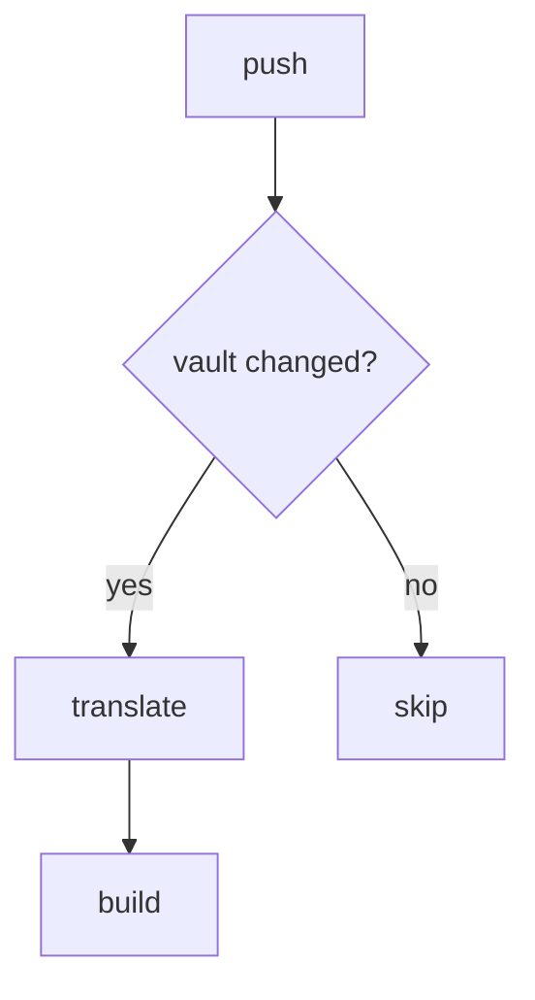

# 语法测试

这是一段普通段落，含 **粗体**、*斜体*、`行内代码`、==高亮==。

## Callout

> [!note] 普通笔记
> 这是 note 类型的 callout 正文。

> [!warning] 警告
> 小心内存泄漏。

> [!danger]- 危险（默认折叠）
> 请不要在生产环境直接跑 `rm -rf /`。

> [!tip]+ 提示（默认展开）
> 使用 `lsof -i` 可以列出打开的网络文件。

## Wikilink

引用一篇真实存在的笔记：[[htb bruno]]。

带别名显示：[[htb bruno|Bruno 靶机]]。

带 heading：[[htb bruno#信息收集]]。

引用一篇不存在的笔记：[[不存在的笔记]]。

## 图片 embed

![[image 1.png]]

![[image 2.png|300]]

## 代码块

```python
def fib(n: int) -> int:
    a, b = 0, 1
    for _ in range(n):
        a, b = b, a + b
    return a
```

```bash
nmap -sC -sV 10.10.11.42
```

## Mermaid



## 数学

行内：$E = mc^2$

块级：

$$
\int_{-\infty}^{\infty} e^{-x^2} \, dx = \sqrt{\pi}
$$

## Dataview（应被删除）

```dataview
LIST FROM #test
```

%% 这段 Obsidian 注释应该消失 %%

正常文字仍在。
